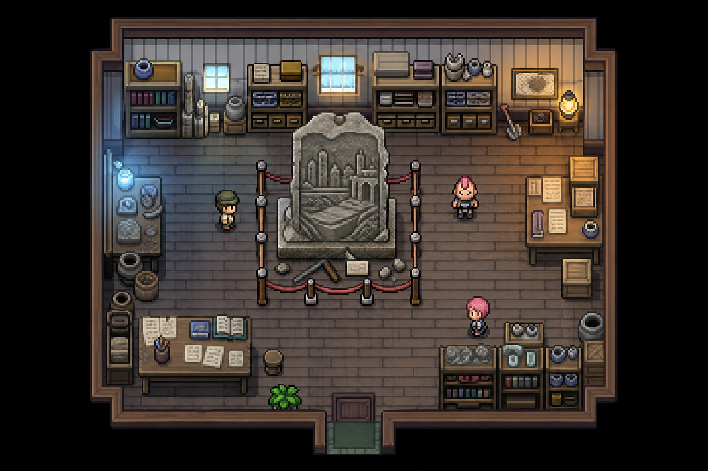

# Referencia visual — Ancla 26



## Propósito

Esta imagen sirve para criticar la dirección visual de **La Estatua que Ensayaba Ciudades**, mapa 1646:

- jerarquía de lectura del monumento central;
- densidad de utilería arqueológica;
- rutas transitables alrededor de la escena;
- proporción y contraste de tres NPCs;
- equilibrio entre iluminación vapor-azul y lámparas cálidas;
- coherencia general con el pixel art Gen 3/4 mejorado.

## Fuentes visuales entregadas al generador

```text
Graphics/Tilesets/Interior general.PNG
Graphics/Characters/trchar008.png
Graphics/Characters/trchar009.png
Graphics/Characters/NPC 04.png
```

No se incorporó ningún asset de otro fangame.

## Límite técnico importante

El PNG es una **referencia conceptual generada por IA**, no una captura del ejecutable ni una hoja RMXP lista para instalar. Conserva bien composición, escala relativa y lenguaje visual, pero algunos objetos tienen detalle y perspectiva que no pueden copiarse literalmente con el tileset actual.

La integración jugable debe reinterpretar la composición usando tiles de 32×32 y sprites existentes o nuevos assets validados. No se debe convertir este PNG directamente en un mapa ni afirmar que sus píxeles son idénticos a los de Fire Ash.

## Preguntas de revisión humana

1. ¿El monumento merece ocupar tanto espacio central?
2. ¿Los NPCs destacan demasiado o demasiado poco frente al fondo?
3. ¿La mezcla de luz azul y ámbar encaja con Fire Ash?
4. ¿La sala parece museo, taller o vivienda, y cuál debería dominar?
5. ¿La densidad de objetos facilita o entorpece la lectura del camino?
6. ¿Conviene mantener el gran relieve urbano o sustituirlo por una estatua más cercana a los assets existentes?
